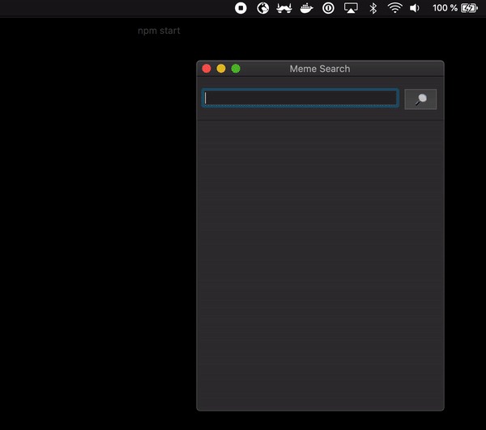

# Meme Search App

This is a meme search app built using NodeGui and Giphy API for the tutorial here:

This app is for educational purposes only.

<center>

</center>

## To run

From your command line:

```bash
npm install
# Run the app
npm start
```

Distributables for Mac, Windows and Linux can be found under releases: https://github.com/master-atul/memesearchapp-nodegui-tutorial/releases

## License

MIT
